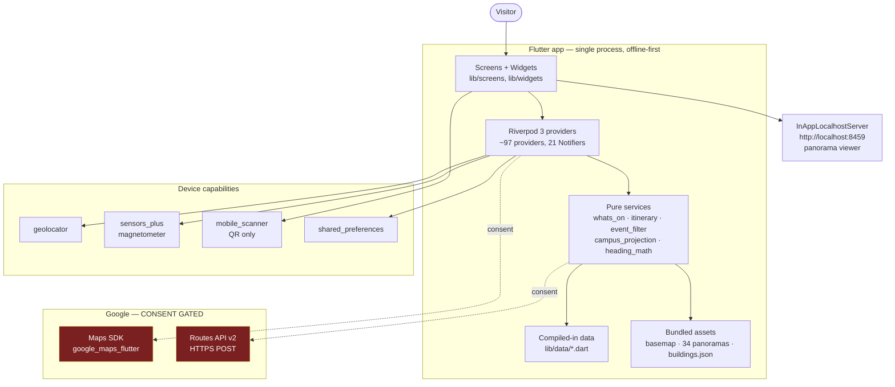
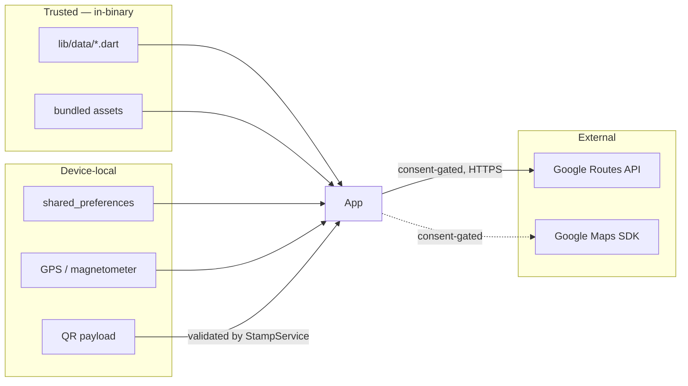

# ARCHITECTURE — Astronomy Open Night 2026 (`aon2026`)

**Status:** authoritative. Written 2026-08-31 against `main`+`feat/panorama-observatory-tour` @ `37fa01a`,
by reading the implementation. Supersedes `docs/architecture.md` (last touched
2026-08-07, now materially wrong — it states "No location permission", which
has been false since the Map Parity programme landed).

Every claim below is traceable to a file. Where evidence was insufficient the
text says **UNVERIFIED** rather than guessing.

---

## 1. What this application is

A single-night, single-campus **event companion app** for Macquarie
University's *Astronomy Open Night*, **Saturday 19 September 2026, 4–10pm**.

| | |
|---|---|
| Package | `aon2026`, bundle id `au.edu.mq.astronomy.aon2026` |
| Version | `1.0.0+1` (`pubspec.yaml`) — **spent** on a Play bootstrap upload; bump before RC |
| Platforms built | **iOS**, **Android**, **web**, **macOS** (`android/ ios/ web/ macos/`) |
| Languages | English + **Persian** (RTL) only |
| Accounts / sign-in | **None** |
| Analytics / crash reporting | **None** (verified: no Firebase/Sentry/Crashlytics in `pubspec.yaml` or `lib/`) |
| Backend | **None.** All content is compiled into the binary |

**Primary user:** a member of the public walking around a dark campus for one
evening. That shapes everything: offline-first, portrait-locked, dark-default,
one-handed, and unusually strict about never stating a fact the organisers
did not publish.

### 1.1 Feature matrix

| Feature | User purpose | Entry point | Main files | Data / services | Tests |
|---|---|---|---|---|---|
| Home | "What's on right now?" | `Routes.home` | `screens/home_screen.dart` | `whats_on_service.dart`, `providers.dart` | `test/widget/home_*_test.dart` |
| Program | Browse/filter 36 entries | `Routes.program` | `screens/program_screen.dart` | `event_filter.dart` | `test/unit/event_filter_*`, `.maestro/program.yaml` |
| My Night | Saved itinerary + clashes | `Routes.myNight` | `screens/my_night_screen.dart` | `itinerary_service.dart`, `saved_events.dart` | `test/unit/itinerary_*`, `.maestro/my-night.yaml` |
| Map | Illustrated campus map, pins, search, favourites | `Routes.map` | `screens/map_screen.dart` | `campus_projection.dart`, `map_placement.dart` | `test/widget/map_*`, `.maestro/map-*.yaml` |
| 360° tours | Look inside a venue before walking there | `Routes.panorama` | `screens/panorama_screen.dart` | `panorama_data.dart`, `panorama_server.dart` | `test/unit/panorama_*`, `.maestro/map-360-picker.yaml` |
| Compass / point-me | "Which way is X?" | `Routes.pointMe` | `screens/point_me_screen.dart` | `compass_controller.dart`, `heading_service.dart` | `test/unit/heading_*`, `compass_*` |
| Walking directions | Google walking route | `Routes.googleNav` | `screens/google_nav_screen.dart` | `google_routes_service.dart`, `maps_nav_providers.dart` | `test/unit/maps_*`, `.maestro/map-wayfinding.yaml` |
| Wayfinding | Hand-authored offline routes | `Routes.wayfinding` | `screens/wayfinding_screen.dart` | `routes_data.dart` | `test/widget/wayfinding_*` |
| Passport | QR stamp rally | `Routes.passport` | `screens/passport_*.dart` | `stamp_service.dart`, `passport_store.dart` | `test/unit/passport_*`, `stamp_*` |
| Info / Settings | Practical info, language, privacy, erase | `Routes.info` / `Routes.settings` | `screens/info_screen.dart`, `settings_screen.dart` | `app_settings.dart`, `local_data_eraser.dart` | `.maestro/settings.yaml` |

> **Note:** "AR" appears in some older planning docs. **There is no AR in this
> app** — no camera-overlay rendering, no AR framework. The camera is used
> *only* as a QR scanner (`mobile_scanner`). What people colloquially call "the
> AR photos" is the **360° panorama** subsystem (§9).

---

## 2. System architecture



**The only outbound network traffic the Dart code makes is the Google Routes
POST** (`google_routes_service.dart:50`). Everything else is local: bundled
assets, `shared_preferences`, and a loopback HTTP server for the panorama
WebView. The Google Maps SDK makes its own native requests once keyed.

### 2.1 Architectural style — described honestly

This is **not** Clean Architecture, MVVM, or BLoC. It is a **layered
Riverpod app with a strong "pure service" discipline**:

- **Data** is `abstract final class` constants in `lib/data/` — no repository
  layer, because there is no backend to abstract.
- **Services** are mostly *pure static functions over injected inputs*
  (`WhatsOnService.classifyAll(events, now)`). Time is a parameter, never
  `DateTime.now()` inside logic — that is what makes a future-dated event
  testable at any instant.
- **Providers** wire data → services → UI, and own all mutable state.
- **Platform I/O** sits behind small interfaces (`LocationService`,
  `HeadingService`, `PassportStore`) that are overridden in `main.dart` and
  faked in tests.

There is no dependency-injection framework beyond `ProviderScope` overrides.

---

## 3. Repository map

```text
lib/
├── main.dart              bootstrap, ProviderScope overrides (§4)
├── app/
│   ├── router/            go_router: 6-tab StatefulShellRoute + pushed routes
│   └── theme/             aon_palette (context.aon.*), aon_spacing, aon_theme
├── config/                EventConfig — event identity, date, defaults
├── data/          (9)     the entire content set, compiled in
├── models/       (15)     Event, Venue, Building, EventSession, DataConfidence…
├── services/     (46)     providers + pure domain logic + platform adapters
├── screens/      (14)     one per route
├── widgets/      (43)     glass surfaces, cards, map layers, compass rose
├── utils/         (5)     TimeFormat, venue_style, timing_labels, haptics
└── l10n/                  app_en.arb + app_fa.arb (+ generated/, do not edit)

assets/          ~50 MB    maps/ (official basemap) · data/indoor (34 panoramas)
                           data/buildings.json · web/ (pannellum viewer) · branding/
tools/                     aon_map/ (georef) · panorama/ (encode) · reskin/ · coverage/
scripts/check.sh           THE quality gate (§13)
.maestro/                  11 E2E flows — NOT in the gate, needs a booted device
docs/                      specs, audits, release artefacts, provenance
```

**Generated / vendored — do not hand-edit:** `lib/l10n/generated/`,
`assets/web/pannellum/` (MIT, © Matthew Petroff), `build/`, `coverage/`.

---

## 4. Startup

`lib/main.dart:75-143`

```text
main()
 └─ WidgetsFlutterBinding.ensureInitialized()
 └─ SystemChrome.setPreferredOrientations([portraitUp, portraitDown])   ← portrait lock
 └─ SystemChrome.setSystemUIOverlayStyle(...)
 └─ await GlassShaderCache.ensureLoaded()        non-fatal; falls back to frost/solid
 └─ await loadPassport()        ┐
 └─ await loadFavorites()       ├─ all three NEVER throw; a storage failure
 └─ await loadMapsConsent()     ┘  degrades to empty / unknown, never blocks launch
 └─ PlatformMapsSdkInitializer(apiKey: String.fromEnvironment('MAPS_API_KEY'))
 └─ await mapsSdkInitializer.resolveKey()        reads config only — contacts nobody
 └─ runApp(ProviderScope(overrides: [...12 overrides...], child: AonApp()))
      └─ AonApp builds MaterialApp.router (router built ONCE, held in state)
           └─ first screen: Routes.home
```

**Blocking async at launch:** shader preload + 3 `SharedPreferences` reads +
one key resolution. All are failure-tolerant by construction.

**Why the key is resolved at runtime, not compile time:** `MAPS_API_KEY` is a
`--dart-define`, so an app launched from Xcode without `--dart-define-from-file`
reported "not configured" on a perfectly well-keyed build. `resolveKey()` asks
the Dart define *then* the platform config (iOS `GMSApiKey`, Android
`geo.API_KEY`), and one runtime value feeds both the capability gate and the
Routes fallback so they can never disagree (`main.dart:105-131`).

---

## 5. Navigation

`go_router` ^17.3, one `StatefulShellRoute` so each tab keeps its own stack and
scroll position.

> The `app_router.dart` header comment says **"five tabs"**. There are **six**
> branches. Stale comment; the sixth (Settings) is what shifted the Maestro
> tab-tap point from 68% to 58%.

| Route | Purpose | Entry conditions | Parameters | Next |
|---|---|---|---|---|
| `home` | Happening now / up next | tab 1 | — | event detail, map |
| `program` | Full programme | tab 2 | — | event detail |
| `myNight` | Saved plan | tab 3 | — | event detail |
| `map` | Campus map / 360° / compass | tab 4 | optional focus key `venue:x` \| `building:y` | panorama, googleNav, pointMe, wayfinding |
| `info` | Practical info | tab 5 | — | — |
| `settings` | Language, theme, privacy, erase | tab 6 | — | passport preview |
| `eventDetail` | One activity | pushed | event id | map (show on map), googleNav |
| `panorama` | 360° tour | pushed | venue id | — |
| `pointMe` | Compass to a target | pushed | venue/parking id (URL-encoded) | — |
| `googleNav` | Google walking route | pushed | place key (URL-encoded) | **consent gate** |
| `wayfinding` | Offline written route | pushed | destination | — |
| `passport` / `passportScan` / `passportReward` | Stamp rally | pushed | — | — |

**Gates:** `googleNav` is gated on Maps consent (§10). `passportScan` is gated
by `scan_gate.dart`. A deep link to a removed event (the cancelled Huntsman
session) is handled explicitly in `event_detail_screen.dart:36`.

---

## 6. State management

**Riverpod 3, hand-written, no codegen.** ~97 providers across `lib/services/`,
21 `Notifier` subclasses.

Riverpod 3 removed `StateProvider`, so the idiom throughout is a
`Notifier<T>` exposing **methods** (`select`, `setQuery`, `toggle`) — never
external `.state =` mutation. `AsyncValue.valueOrNull` is **not** available in
the resolved core; use `.asData?.value`.

| Kind | Examples | Lifetime |
|---|---|---|
| Static content | `eventsProvider`, `venuesProvider`, `routesProvider` | app |
| Derived | `filteredEventsProvider`, `happeningNowProvider`, `itineraryProvider` | recomputed |
| Persisted | passport stamps, favourites, maps consent, settings | `shared_preferences` |
| Ephemeral device | location fix, heading, compass lock | stream-backed, gated on visibility |
| Capability | `mapsSdkReadyProvider`, `nativeMapsApiKeyProvider` | app |

### 6.1 The persistence idiom (four places use it)

Passport, favourites, maps-consent and settings all follow the same shape:
**load a snapshot in `main()` → inject it plus the store via `ProviderScope`
overrides → seed a synchronous `Notifier` → serialise writes through a Future
chain → never throw on failure.** Copy this pattern; do not invent a fifth one.

### 6.2 Known stale-state hazard

`ref.invalidate` is **worse than useless** for the erase-my-data flow: `build()`
re-seeds from the startup snapshot and *restores* what was deleted. The
implementation uses `clearAll()`/`reset()` + `flush()`, **session before
storage**.

---

## 7. Data flow — worked examples

**"What's happening now?"**
```text
Home builds → happeningNowProvider → timedEventsProvider
  → WhatsOnService.classifyAll(EventsData.all, clockProvider now)
  → per event: sessionAt(now) → EventTiming bucket
  → TimingConfidence decides whether a bucket is even legal
  → TimedEvent list → EventCards
```

**"Show me on the map"**
```text
Tap "Show on map" → go(Routes.mapFocused('venue:x'))
  → MapScreen reads selectedPlaceKeyProvider → placeResolverProvider
  → map_placement.placeVenue(venue)  ← three-tier fallback, §8.2
  → camera.move(point, MapConfig.mapFocusZoom)   ← the zoom is load-bearing, §8.3
  → venue sheet opens
```

**"Walking directions"** — see §10, this is the consent-critical path.

**"Scan a passport stamp"**
```text
passportScan → mobile_scanner → decoded string
  → StampService.redeem(code) → PassportPolicy.isCollectionEnabled
  → (release builds: DISABLED while codes are AON-*-TBC, unless Preview is on)
  → passportStore.save() → passportProvider → reward screen
```

---

## 8. Maps, location, navigation

### 8.1 Two map systems, deliberately

| | Campus map | Google map |
|---|---|---|
| Library | `flutter_map` 8.3 with **`CrsSimple`** | `google_maps_flutter` |
| Content | The **official AON 2026 A3 programme map**, as a single overlay image | Google's own tiles |
| Network | **None** — the image is bundled | Google's |
| Consent | not required | **required** |
| Where | Map tab | `googleNav`, wayfinding route preview |

There are **no OSM tiles**; a test fails if a tile endpoint reappears
(`maps_sdk_boundary_test.dart:53`).

### 8.2 How a pin gets placed — `map_placement.dart`

Three tiers, highest first:

1. **`Venue.artworkX/Y`** — pixels measured on the printed artwork's *own*
   markers (17 venues). This exists because five Central-Courtyard venues
   shared one GPS coordinate and stacked into identical hit boxes, and because
   **first aid has no GPS fix at all** yet must still render.
2. **Baked `campusX/Y`** (buildings, 170 in `assets/data/buildings.json`).
   Necessary, not merely convenient: 21/170 buildings fall outside the
   GPS-affine domain and would be dropped by `project()`.
3. **GPS → `CampusProjection.project()`**.

`latitude`/`longitude` are **never** overwritten by artwork pixels, so bearing,
compass and routing stay geographically truthful. **Never read `artworkX/Y` as
geographic.**

### 8.3 `flutter_map` + `CrsSimple` traps (each cost real debugging)

- Scale is `256·2^zoom`; the campus frames at zoom ≈ **-6.3**. Repo uses
  `mapMinZoom=-8, mapMaxZoom=1`.
- `CameraFit.bounds` has its **own** `minZoom` defaulting to 0 — pass
  `minZoom:`/`maxZoom:` *into* it, and re-fit in `onMapReady`.
- `CameraConstraint.contain` is unsatisfiable when campus < viewport → use
  `containCenter`.
- **Never clamp *zoom* in a `CameraConstraint`** — it breaks `flutter_map`'s
  option-change idempotency assertion on viewport resize. Use a dynamic
  `MapOptions.minZoom` via `LayoutBuilder`.
- Opening a place from Search/Favourites **must** pass
  `zoom: MapConfig.mapFocusZoom`. Without it the camera lands at a cover-fit
  zoom where the target cannot be centred, tripping a debug-only `assert` —
  a P1 crash invisible in release (MAP-006, `docs/map-audit-2026-08-30.md`).

### 8.4 Location

`geolocator` behind `LocationService`. Streams are gated on visibility
(`mapVisibleProvider` / `compassVisibleProvider`) so nothing runs in the
background.

**Fix settling** (`location_providers.dart:20-43`) — from a field report:
the dot appeared far off then hopped several times. `shouldAdoptFix` keeps the
sharpest fix, ignores movement inside the incoming fix's own uncertainty, and
rejects implausible jumps above `maxPlausibleStepMetersPerSecond = 12.0`.

**Preview mode** (`preview_location.dart`) simulates an on-campus fix so the
app is reviewable off-site. It must be visibly badged **wherever a position is
drawn**, not only where the switch lives.

### 8.5 Failure behaviour

| Condition | Behaviour |
|---|---|
| Location denied | Map still works; honest "turn on location" state |
| Fix off campus | Distance banner ("N km from campus"), **never** a dot clamped to the artwork edge |
| Directions requested off campus | "Walking directions are available once you are on campus" |
| Routes API fails (currently **HTTP 401**) | "Walking route is temporarily unavailable. The map still shows your destination." + Retry / Open in Google Maps |
| No compass hardware | Degrades to an honest distance-sorted **cardinal list** |
| No Maps key | Keyless external-Maps fallback |

---

## 9. The 360° panorama subsystem (the "AR photos")

**Tours across 9 locations** — the 8 A–I legend venues plus the Solar system
walk route — from 39 distinct bundled images (46 scene entries; the walk reuses
8 images the legend venues already carry).

### 9.1 How it renders

```text
PanoramaScreen(venueId)
 → PanoramaData.tourFor(venueId)      EXACT lookup, never interpolated (§14)
 → indoorManifestProvider loads assets/data/indoor/<venue>.json
 → panorama_server starts InAppLocalhostServer(documentRoot: 'assets', port 8459)
 → PanoramaTourView → flutter_inappwebview
 → http://localhost:8459/web/indoor_viewer.html  (Pannellum, MIT)
 → scene rail switches nodes
```

### 9.2 Tour inventory

| Legend | Venue | Scenes | Source |
|---|---|---|---|
| A | Macquarie Theatre | 2 | MQ_Journey |
| B | Mason Theatre | 1 | MQ_Journey |
| D | 14 Sir Christopher Ondaatje Ave | 6 | AON + Journey |
| E | 1 Central Courtyard | 12 | AON shoot |
| F | Sport & Aquatic Centre | 3 | AON shoot |
| G | Astronomical Observatory | 2 | AON shoot (added 2026-08-31) |
| H | 11 Wally's Walk | 3 | AON shoot |
| I | 17 Wally's Walk | 4 | MQ_Journey |
| — | Solar system walk (`gymnasium-road`) | 13 | AON shoot (8 reuse E/F/G; 5 new) |

The **picker** lists the **D–I letter catalogue** (`panoramaPickerVenuesProvider`
/ `_panoramaPickerMapReferences`), and pins the **Solar system walk as a card at
the top**, above D. The walk is a route, not a lettered venue (`gymnasium-road`
has `mapReference: null`), so it is deliberately kept OUT of the letter provider
and rendered separately — which is also why the picker's `v.mapReference!` on the
letter list stays safe. A and B keep working tours reachable from their venue
sheets, but are not in the top-level catalogue. C (Food and drink) is
deliberately absent — no panorama is planned, so it must never read "coming soon".

The walk reuses imagery via **`build.py` aliasing**: a TOURS scene may carry a
5th tuple element naming an explicit bundled asset path; the encoder skips it and
the manifest points at the shared file, so a photo used by two tours is bundled
once (~9.5 MB for the walk instead of ~26). `dangling_aliases()` fails the build
if an alias resolves to no bundled file.

### 9.3 How ordering correctness is established

**Not from the current implementation, and not from EXIF GPS position.**

- Tour order = the **official programme's A–I legend**, which is printed on the
  bundled basemap.
- Scene order = the photographer's own naming, corroborated by **EXIF GPS
  timestamps** (`GPSDateStamp`/`GPSTimeStamp`, UTC +10 = AEST).
- **Solar system walk** scene order is the **organiser's own numbering**
  (Raouf, 2026-09-01), 1 → 13, Courtyard → Telescope Park — the direction
  visitors walk it. It supersedes the timestamp-inferred order in the design
  spec, and every numbered source was verified byte-identical to its pinned
  original before encoding.
- **EXIF GPS *position* is unusable**: measured against `buildings.json` the
  error runs **21 m to 1377 m**, and `1 CC- Downstairs.JPG` places a shot taken
  beside 1 Central Courtyard **945 m** away. Never order or place a scene by it.

### 9.4 No hotspots, on purpose

The originals carry `ProjectionType` and **no `PoseHeadingDegrees`**. There is
no honest way to know which direction a scene faces, so every manifest node has
`neighbours: []` and navigation is the scene rail. **Do not add hotspots by
eye** — a bearing that looks plausible is still invented.

### 9.5 Known gap

Six AON originals are **reserved, not unused**: they are the *Solar system walk*
route along Gymnasium Road. Specified in
`docs/superpowers/specs/2026-08-31-solar-system-walk-tour-design.md`,
**not built**. `build.py` derives every asset path from `{venue}_{scene}.jpg`,
so building it as-specified would emit three duplicate images — it needs an
aliasing mechanism first (spec §3.1).

---

## 10. Privacy and consent

### 10.1 The consent invariant — the app's single most important rule

> **No Google surface capable of transmitting data may initialise before
> consent resolves positively.**

Enforced at exactly one point: **`mapsSdkReadyProvider`**
(`maps_sdk_initializer.dart:152`) short-circuits on consent *before* touching
the initialiser. `AppDelegate` must **never** call `GMSServices.provideAPIKey`
at launch — it sits behind the `aon2026/maps_sdk` method channel.

Consent alone is not enough: a `GoogleMap` built against an unkeyed SDK renders
blank, so both surfaces also gate on **readiness**.

**How consent is obtained (explicit first-use disclosure — B2, 2026-09-01).**
A first-run `unknown` consent shows the **`MapsNavDisclosure` dialog** before any
Google surface: `google_nav_screen.dart` `_showDisclosureOnce()` renders it, and
its result maps to consent — **Accept** → `accepted` (the map + route then load),
**Decline** or barrier-dismiss → `declined` (the sharing-off panel, with a
one-tap re-enable). The passive notice and the OFF switch also live in Settings.
The §2b invariant holds *by construction*: `mapsSdkReadyProvider` and the
location/route reads are all reached only after `consent == accepted`, so nothing
Google-facing initialises while consent is `unknown` (behind the disclosure) or
`declined`. Because agreement is now an explicit step, the privacy copy
("sent to Google only … after you agree" / the hosted policy's "asks you before")
is accurate as written. Tests: `google_nav_screen_test.dart`
("B2: first-run … shows the disclosure BEFORE any Google surface; Accept then
routes" and the Decline case), `routes_consent_guard_test.dart`,
`maps_sdk_ready_provider_test.dart`.

`ConsentGuardedRoutesService` reads consent through a **callback** (never
cached) and re-checks *after* the await. A request already on the wire cannot
be recalled, but its response is discarded — do not restore the overclaim that
it "cancels in-flight requests".

`test/unit/maps_sdk_boundary_test.dart` fails if anything outside
`maps_sdk_initializer.dart` names `MapsSdkInitializer`, if any file outside
`embedded_map.dart` constructs a `GoogleMap`, if `flutter_map` loses its
consumer, or if an OSM endpoint reappears.

### 10.2 Permissions

| Permission | Why | When asked | If denied | What leaves the device |
|---|---|---|---|---|
| Location (`ACCESS_FINE`/`COARSE`, `NSLocationWhenInUse`) | Dot on campus map; compass; nav origin | First Locate tap / compass entry | Map still works; honest empty states | **Nothing — except** the origin `latLng` POSTed to Google Routes *after* consent |
| Camera | QR passport stamps **only** | Entering the scanner | Passport unusable, rest fine | Nothing — decoded on device |
| Motion (`NSMotionUsageDescription`) | Magnetometer heading | Compass mode | Cardinal-list fallback | Nothing |

No `AD_ID`, no storage/media, no `GET_ACCOUNTS`, no background location —
which is the only reason the Play Data-safety form can answer "no data
collected". `android_permissions_policy_test.dart` fails if that changes.

### 10.3 ⚠️ Confirmed discrepancy (see Risk R1)

`NSLocationWhenInUseUsageDescription` says *"Your location stays on your device
and is never sent anywhere."* That is **false on the Google directions path**:
`google_routes_service.dart:58` POSTs the live `latLng` as `origin`.

The in-app copy is correct (`settingsPrivacyBody`: *"It is sent to Google only
when you ask for walking directions — and only after you agree"*), and the
hosted policy draft explicitly avoids the claim
(`docs/release/mq-hosted-pages.md:185`). **Only the iOS purpose string was left
behind when Google nav landed.**

---

## 11. Security

**Trust boundaries**



- **Secrets:** never committed. `.env` is git-ignored (`.gitignore:58`, verified
  untracked); `ios/Flutter/Secrets.xcconfig` ignored; `android/secrets.properties`
  optional with an `.env` fallback. `.sample` files are committed.
- **External input:** the QR payload is the only untrusted *data* input, and it
  is matched against a fixed station list, not executed.
- **WebView:** loads **only** `http://localhost:8459/web/indoor_viewer.html`.
  Android cleartext is permitted for **loopback only**
  (`res/xml/network_security_config.xml`); `android_cleartext_policy_test.dart`
  fails if anyone widens it to `usesCleartextTraffic="true"`.
- **Android release signing fails CLOSED** — the check lives in
  `gradle.taskGraph.whenReady`, deliberately *not* in `buildTypes { release }`
  (which is configuration-time and would break debug builds).
- **Logging:** 7 `debugPrint`/`print` calls in `lib/`. `nav_trace.dart` is
  `kDebugMode`-gated, so traces vanish in profile/release. No sensitive-value
  logging found.

---

## 12. Configuration

| Configuration | Purpose | Required? | Source | Secret? |
|---|---|---|---|---|
| `MAPS_API_KEY` | Maps SDK + Routes | For Google features only | `--dart-define-from-file=.env`, or `android/secrets.properties`, or `ios/Flutter/Secrets.xcconfig` | **Yes** |
| `MAPS_NATIVE_CONFIGURED` | Native-key sanity flag | No | dart-define | No |
| `EventConfig.astronomyOpenNight` | Event id, date, defaults | Yes | `lib/config/event_config.dart` | No |
| Android signing | Release builds | Release only | git-ignored keystore properties | **Yes** |
| `version: 1.0.0+1` | Store version | Yes | `pubspec.yaml` | No |

Four GCP-restricted keys are expected (SDK ×2 + Routes ×2). The app degrades to
a keyless external-Maps hand-off without them.

---

## 13. Testing

| Area | Location | Purpose | How to run |
|---|---|---|---|
| Unit | `test/unit/` (99 files) | data honesty, timing, projection, search, policy | `flutter test test/unit` |
| Widget | `test/widget/` (96 files) | rendering, a11y, overflow, responsive | `flutter test test/widget` |
| **Full gate** | `scripts/check.sh` | **the blocking gate** | `./scripts/check.sh` |
| E2E | `.maestro/` (11 flows) | real device journeys | `maestro` MCP; **not in the gate** |
| Python | `tools/reskin/` | reskin transforms | run by the gate |

**`./scripts/check.sh` runs 7 steps:** pub get · flutter analyze · vendored
asset provenance (SHA) · l10n EN+FA completeness · `flutter test --coverage` ·
**coverage policy** · reskin tests. `dart format` is reported but is
**informational only** — the repo has pre-existing 3.12 tall-style drift across
235 files; **do not blanket-reformat.**

**The one hard rule for committing** — gate on `check.sh`'s *own exit code*,
never through a pipe:

```bash
./scripts/check.sh > /tmp/gate.log 2>&1 && git add -A && git commit -F msg.txt || { echo "GATE FAILED"; tail -20 /tmp/gate.log; }
```

`check.sh | tail && git commit` is a trap — the pipeline's status is `tail`'s,
so a red analyze/test still commits. This has bitten the repo before.

**Coverage gate:** a ratcheting policy in `tools/coverage/policy.json` — a
whole-repo floor, an 80% per-file minimum unless exempt or on debt, and a
**paid-off debt entry or stale exemption also fails**, so neither list can rot.
**There is no function-coverage number** — `flutter test --coverage` emits only
`DA:` line records. Never promise "100% of functions".

**E2E gotchas** (`.maestro/README.md`): merged semantics mean `text:` must match
the FULL string; EN+FA wraps labels in bidi isolates U+2068/U+2069 (match with
`.*X.*`); multi-line a11y strings need `(?s)` DOTALL; the Map tab tap point is
**tab-count dependent** (58% for six tabs); a dialog button's *label* is not its
hit target — tap by point.

---

## 14. Critical invariants

Rules that must not be broken. Each is enforced by a test or by a documented
incident.

1. **Consent before any Google surface initialises.** `mapsSdkReadyProvider` is
   the single enforcement point. `maps_sdk_boundary_test.dart`.
2. **Never state a time the organisers did not publish.** `TimingConfidence`
   carries the distinction the raw times cannot; `hasPublishedEnd` gates every
   countdown, and `hasPublishedStart` gates the "up next" start time — an
   `openAllNight` activity (Solar system walk: "no set opening times") has no
   published start, so no card may show its 4pm stand-in as a start.
   `unpublished_time_test.dart`, `open_all_night_start_time_test.dart`.
3. **One clear truth per card.** Never render "Time not published" *and* a time
   range together. `liz_update_2026_08_31_test.dart`, `session_label_test.dart`.
4. **An open-all-night drop-in must never clash with a scheduled session** —
   it overlaps everything by construction. `ItineraryService._overlaps`.
5. **`artworkX/Y` is never geographic.** Never write it into
   `latitude`/`longitude`. `venue_artwork_placement_test.dart`.
6. **Never order or place a panorama by EXIF GPS position** (§9.3).
7. **No invented panorama hotspots** — no pose metadata exists (§9.4).
8. **`PanoramaData.tourFor` is an exact lookup** — never interpolate an asset
   path from a venueId.
9. **No OSM attribution, no OSM tiles.** The app makes no OSM requests;
   `map_attribution_test.dart` scans both ARBs.
10. **No `©` on the campus-map attribution** until MQ's ownership sign-off
    lands — it reads "Campus map: Macquarie University" (source, not copyright).
11. **Never clamp zoom in a `CameraConstraint`** (§8.3).
12. **Every new string needs EN *and* Persian**, real translation, and every
    `int` placeholder needs `"format": "decimalPattern"` or Persian renders
    Western digits mid-sentence.
13. **Never build a sentence in Dart and slice it apart** — give the ARB the
    shape the UI needs.
14. **Erase-my-data clears the session before storage**; `ref.invalidate`
    restores deleted data from the startup snapshot.
15. **Huntsman stays removed; Kids' space in Room 109 stays.** The source PDF is
    the *wrong* answer here. `huntsman_exclusion_test.dart`.
16. **Android cleartext stays loopback-only.**
17. **Android release signing fails closed.**

---

## 15. Known risks and technical debt

| # | Risk | Impact | Evidence | Recommendation |
|---|---|---|---|---|
| **R1** | ~~iOS location purpose string claims location is "never sent anywhere"~~ **FIXED 2026-09-01 (release blocker B1)** | Was an inaccurate App Store disclosure | `ios/Runner/Info.plist` now reads "…sent to Google only when you choose walking directions"; guarded by `ios_location_purpose_test.dart` | RESOLVED — AWAITING VERIFICATION: confirm the shipped string in the release build |
| **R2** | Google Routes returns **HTTP 401** | Directions unusable | Field log 2026-08-28; verified as GCP key restriction, not code | Configure the 4 restricted keys |
| **R3** | ~~Passport disabled in release builds~~ **RESOLVED 2026-09-04** — residual risk is signage, not code | Headline feature inert on the night | All 9 codes were `AON-*-TBC`; now live (`AON-A-FL3R` … `AON-I-JRYL`, all `confirmed`) and the release gate opens | Signs must be the ones `tools/passport/build_station_qr.py` generates — the app accepts these codes and nothing else |
| **R4** | Redistribution permission unresolved for **4 asset sets** | Blocks public release | `docs/panorama-image-provenance.md` | Confirm before store submission |
| **R5** | 3 of 7 map E2E flows were red on `main` (map-modes, map-wayfinding, map-location) | Was false confidence | Re-run 2026-09-01 on iPhone 17 sim; each classified on-device | **Stale/flawed tests, not app defects** — all fixed: map-modes lacked a location fix for the compass list; map-wayfinding was rewritten mid-Sep for the auto-accept model, then updated again after B2 restored the explicit first-use disclosure (2026-09-01); map-location teleported a fix the settling policy correctly rejects. 7/7 green after the fix |
| **R6** | `mason-theatre` and `14-sir-…` share building, address **and coordinates** | Duplicate 360 entry points | `venues_data.dart`; source photo `14-christopher-Mason-theatre.jpg` | Decide whether to merge tours |
| **R7** | **No CI/CD** | The gate only runs when someone remembers | No `.github/workflows` | Add a workflow running `check.sh` |
| **R8** | `docs/architecture.md` stale since 2026-08-07 | Actively misleading ("No location permission") | File header | Superseded by this document |
| **R9** | 22 orphaned ARB keys; no gate detects them | Copy drifts back to hardcoded English beside a good key | i18n audit 2026-08-24 | Add an orphan tripwire |
| **R10** | `1.0.0+1` already spent on a Play upload | Upload rejected | Plan B C1 | Bump before RC |
| **R11** | Web runtime black-screens at bootstrap | Web unusable | Pre-existing; web *build* passes | Out of scope for the event |
| **R12** | `lib/data/` content is English-only | Persian users see English event copy | Deliberate — translating is an organiser decision | Confirm with organisers |
| **R13** | Room 106 keeps a 360 scene but has no activity | Minor tour noise | Kids' space moved to 109 | Decide whether to drop the scene |

**Unverified concerns:** whether Liz's "astrophotography display" is a second
activity or (as implemented) the same as Capture the cosmos; the arrival order
of the two Observatory scenes for a northbound walker.

---

## 16. Baseline state (2026-08-31)

### Builds
- ✅ iOS simulator (`flutter build ios --simulator --debug`) — verified today
- ✅ Web, APK, iOS-sim via `./scripts/check.sh full` — per repo history, **not re-run today**
- ⚠️ macOS blocked by a Flutter+Xcode 26 clang bug (flutter#178195), worked around in the macOS pbxproj

### Tests
- ✅ `./scripts/check.sh` → **CHECK PASSED, 7/7, exit 0**, coverage **90.94%** (floor 90.4%)
- ✅ `flutter test` → **1601 tests passing, exit 0** (re-run 2026-08-31 for this document)
- ✅ `flutter analyze lib test` → **No issues found**
- ⚠️ Maestro map suite **5/7** — 2 pre-existing failures, proven against `main` (R5)
- ⚠️ Maestro is **not** part of `check.sh` and needs a booted device
- ❌ **No CI/CD** — verified: no `.github/workflows`, no other pipeline config (R7)

### Known blockers to complete verification
GCP keys (R2), physical-device testing, passport signage install (R3), MQ-hosted URLs.

### Manual validation still required
On-device heading with a real magnetometer; live Google route render; panorama
on real hardware (simulator-verified only); Android screenshots at ≤2:1.

---

## 17. Where to look next

| Topic | Document |
|---|---|
| Operating rules for AI sessions | `CLAUDE.md` *(git-ignored — see note)* |
| Panorama rights & limitations | `docs/panorama-image-provenance.md` |
| Programme sources & open questions | `docs/data-sources.md`, `docs/mq-staff-questions.md` |
| Release artefacts | `docs/release/` |
| Recent audits | `docs/map-audit-2026-08-30.md`, `docs/home-program-audit-2026-08-30.md`, `docs/settings-mynight-audit-2026-08-30.md` |
| Specs & plans | `docs/superpowers/` |
| E2E selector traps | `.maestro/README.md` |

> **`CLAUDE.md` is listed in `.gitignore` (line 2)**, so collaborators and CI do
> not receive it. That is a deliberate existing convention, but it means the
> operational guide is per-machine. Consider tracking it.
