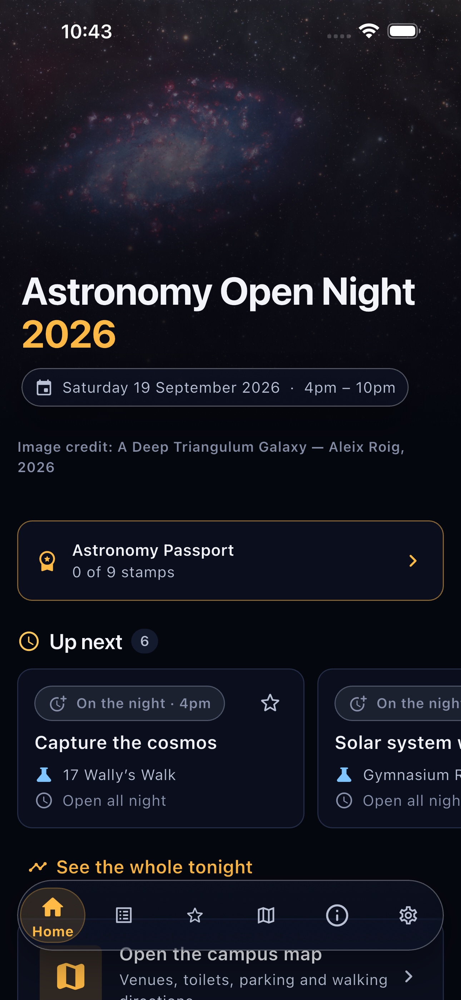
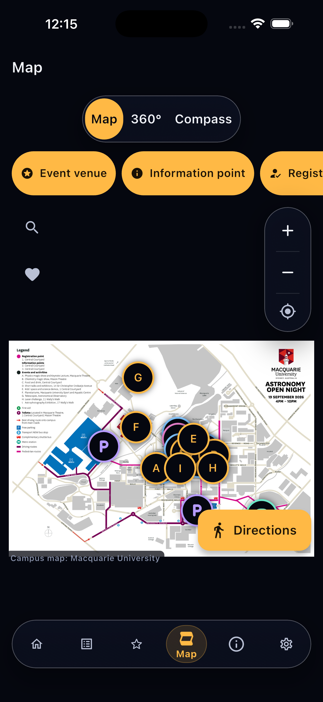
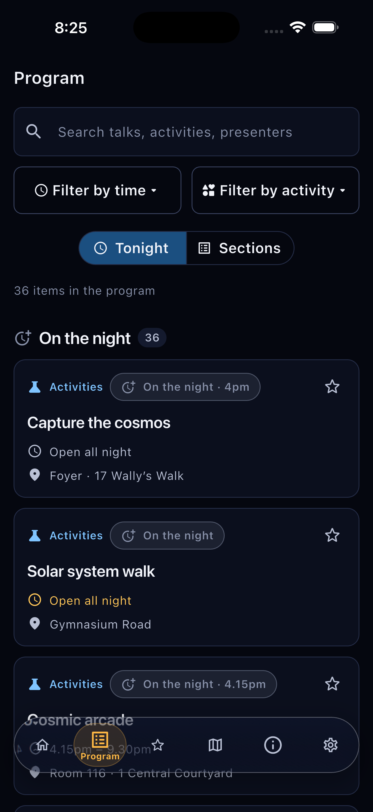
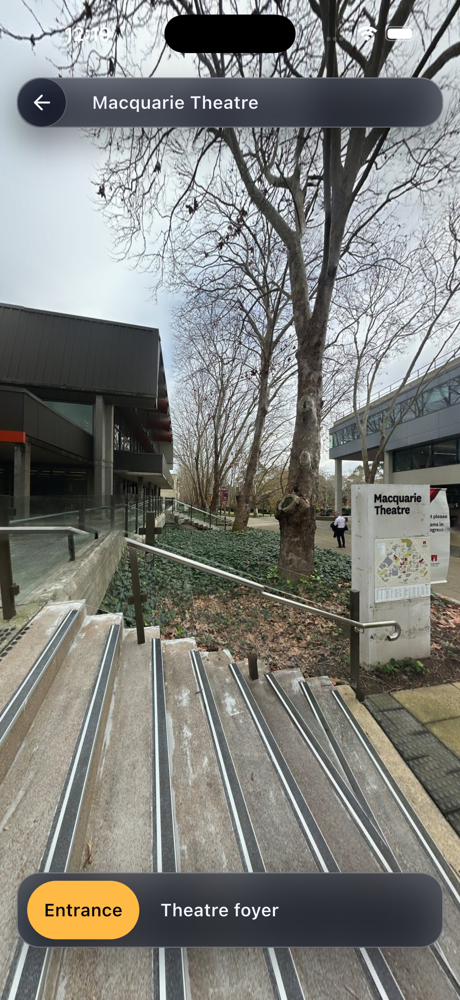
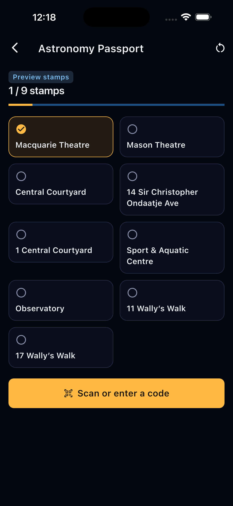
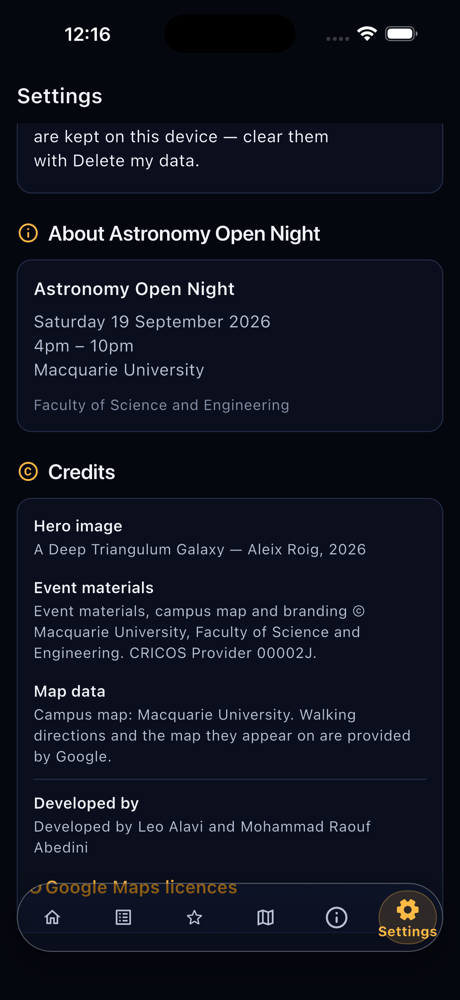

<div align="center">

<!-- Typing animation -->

[](https://readme-typing-svg.demolab.com)

<!-- Badges -->


</div>


<br/>

# Astronomy Open Night 2026

> **A full-stack Flutter event guide and night-time campus wayfinding app, built for Macquarie University's Astronomy Open Night — programme browsing, a campus map, 360° venue previews, and a QR passport rally, with zero backend and zero accounts.**

Astronomy Open Night helps a visitor answer two questions on the night: **"what's on right now?"** across 36 official programme items in 9 venues over 6 hours, and **"how do I get there in the dark?"** — the organisers specifically asked for clearer guidance between the car parks and the venues, because attendees get disoriented at night.

It is an independent student project, **not an official Macquarie University product** — see [Attribution](#-attribution--rights) for exactly what belongs to whom. Built on Flutter 3.44 and Riverpod 3, it ships as an iOS/Android/web app with **all event data compiled into the binary**: no developer-operated server, database or accounts. Android Maps and scanner SDKs report technical/usage data; see the [privacy audit](GOOGLE_PLAY_RELEASE_AUDIT.md).

**[🏗️ Architecture](./ARCHITECTURE.md)** &nbsp;·&nbsp; **[📖 Docs](#-documentation-map)** &nbsp;·&nbsp; **[🤝 Contributing](./CONTRIBUTING.md)** &nbsp;·&nbsp; **[🔐 Data Sources](./docs/data-sources.md)**

<br/>


<br/>

## 🎯 Problem & Value Proposition

Public university events usually hand visitors a printed A3 map and hope for the best. Astronomy Open Night puts the pieces a visitor actually needs on the night into one offline-first app:

- **Live Programme Awareness:** All 36 official activities, talks and the keynote, filterable by real published start time and activity type, with a live "happening now / starting soon / later tonight" view driven by an injectable clock.
- **Night-Time Wayfinding:** An illustrated campus map with search and favourites, Google Maps walking directions scoped to campus, hand-authored offline routes as a fallback, and a compass "point me there" mode.
- **360° Venue Previews:** Look inside a venue — the Observatory, the planetarium, the lecture theatres — before walking there in the dark.
- **QR Passport Rally:** Scan or type a venue code to collect a stamp and reveal a short astronomy fact, with a torch-enabled scanner and offline manual entry as a fallback.
- **Honesty as a Data Model:** Every fact carries a `DataConfidence` (`confirmed` / `derived` / `placeholder`); nothing the organisers didn't publish is ever invented or inferred — not a coordinate, not a finish time, not a fact.
- **Zero-Trust Footprint:** No accounts, no backend, no analytics, no camera use beyond the QR scanner it's for. Everything a visitor saves lives on their device only.

<br/>


<br/>

## Screenshots

<div align="center">

|                                     Home                                      |                                      Map                                      |                                    Program                                    |
| :----------------------------------------------------------------------------: | :----------------------------------------------------------------------------: | :----------------------------------------------------------------------------: |
|  |  |  |

|                                  360° Tour                                   |                                  Passport                                   |                                   Settings                                   |
| :---------------------------------------------------------------------------: | :---------------------------------------------------------------------------: | :---------------------------------------------------------------------------: |
|  |  |  |

</div>

<br/>


<br/>

## Key Features

```text
╔══════════════════════════════════════════════════════════════════════╗
║  🗓  36 official activities, filterable by real start time/activity  ║
║  📡  Live "happening now / starting soon / later" — injectable clock ║
║  🗺  Illustrated campus map: venues, parking, favourites, search     ║
║  🧭  Google Maps walking directions + offline routes + compass mode  ║
║  🌐  360° panorama previews of the Observatory, planetarium & more   ║
║  🎫  QR passport rally: scan or type a code, collect a stamp + fact  ║
║  🌍  English + Persian, full RTL support, Dynamic Type up to 200%    ║
║  📴  Fully offline event data — only maps/directions need a network  ║
╚══════════════════════════════════════════════════════════════════════╝
```

<br/>


<br/>

## 🏗️ Technical Architecture Overview

### Runtime Stack

| Layer | Technology |
| --- | --- |
| **Framework** | Flutter 3.44 (Dart 3.11), Material 3 |
| **State** | Riverpod 3 (`NotifierProvider` / `AsyncNotifier`), no external state library |
| **Navigation** | `go_router` 17, `StatefulShellRoute` for the six-tab shell |
| **Campus Map** | `flutter_map` 8 on a `CrsSimple` illustrated basemap — no tile server, no API key |
| **Walking Directions** | `google_maps_flutter` + Google Routes API, walking mode only, scoped to campus |
| **360° Viewer** | `flutter_inappwebview` + a loopback HTTP server serving bundled panorama assets |
| **QR Scanning** | `mobile_scanner`, camera requested only when the visitor taps "Scan" |
| **Persistence** | `shared_preferences` only — passport stamps, favourites, saved plan, settings |
| **Location** | `geolocator` (when-in-use only) + `sensors_plus` for the compass |
| **Testing** | 209 test files, **1,663 passing tests** (`flutter_test`), zero backend to mock |

### Key Architectural Decisions

- **Offline-First Event Data.** The full programme, venues, parking and panorama data are `const` Dart compiled into the binary — no asset load, no JSON parse, no cache, no network. Only the map basemap and Google walking directions need connectivity.
- **Time Is Always Injected.** Nothing in the app calls `DateTime.now()` directly; every screen reads `currentTimeProvider`. That is what makes "What's on now" fully testable before the event date ever arrives.
- **Confidence Is a Type, Not a Convention.** `DataConfidence` (`confirmed` / `derived` / `placeholder`) lives on the data itself, and the UI renders a visible note wherever a placeholder appears — a visitor is never shown an invented fact as if it were official.
- **Zero-Credential by Default.** The app builds and runs with no `.env` file at all. The only optional key is a single Google Maps API key for walking directions; without it, the Directions screen shows a clear "not configured yet" message instead of a crash or a fake route.

> **Deep Dive:** [ARCHITECTURE.md](./ARCHITECTURE.md) — full system architecture, data flow, routing table, and known invariants.

<br/>


<br/>

## 🔒 Privacy & Zero-Credential Model

| | |
| --- | --- |
| Accounts / sign-in | **None** |
| Backend / database | **None** |
| Analytics / tracking | No developer-operated analytics; Google Maps/ML Kit SDK diagnostics must be disclosed |
| Required API keys | **None** — the app runs fully "dark" |
| Optional API keys | **1** (Google Maps, for walking directions only) |
| Camera use | QR scanner only, requested only when the visitor taps "Scan" |
| Location use | When-in-use only, for the map and compass — never background |
| Data stored | Passport stamps, favourites, saved plan and settings — **on-device only**, via `shared_preferences` |

Saved plans and stamps are local and erasable from Settings. Android system backups may include local data. Google directions transmit location after consent, and Maps/ML Kit have their own diagnostic data flows. Camera permission is requested lazily — opening the Passport screen never starts the camera or prompts for permission until the visitor explicitly chooses "Scan".

> **For Data Provenance:** [docs/data-sources.md](./docs/data-sources.md) — where every fact, coordinate and time came from, and what is still unconfirmed.

<br/>


<br/>

## 🎯 Project Governance

### License

**No licence has been applied to this repository yet — this is deliberate.** Until a licensing decision is confirmed with all rights-holders, treat this repository as **all rights reserved**. See [Attribution & Rights](#-attribution--rights) for the full breakdown of what is, and isn't, covered by any future licence.

### Roadmap / Open Questions

Tracked and visibly flagged in-app wherever they appear; full detail in [docs/data-sources.md](./docs/data-sources.md).

- **First aid location** — marked on the printed map legend, no address given in text.
- **Shuttle bus** stops, route and timetable — legend-only on the official map.
- **Some activities have no published finish time** — the app never fabricates one; it shows "finish time not published" rather than guessing.
- **Walking route geometry is indicative, not surveyed** — hand-authored offline routes are straight-line estimates until someone walks them after dark with a GPS trace.
- **No accessibility audit yet** — contrast ratios are documented but not formally asserted, and there has been no screen-reader pass.
- **Not yet tested on a real phone, outdoors, at night** — the single most valuable outstanding test before the event.

### Maintainers

| Name | Role |
| --- | --- |
| Leo Alavi | Lead developer — architecture, Flutter/Riverpod, navigation |
| Mohammad Raouf Abedini | Co-developer — passport/QR, 360° panorama subsystem |

<br/>


<br/>

## Repository Layout

```text
lib/
├── app/          Theme tokens, router, text-scale policy
├── config/       Per-event configuration (name, quick access, feature flags)
├── data/         Compiled-in event, venue, parking, panorama and passport data
├── l10n/         English + Persian ARB source and generated localisations
├── models/       Event, Venue, ParkingArea, DataConfidence, timing types
├── services/     Clock, filtering, what's-on logic, Riverpod providers
├── utils/        Formatting, category styling, bidi/RTL helpers
├── widgets/      Shared components (sheets, action buttons, cards)
└── screens/      Home · Program · My Night · Map · 360° · Passport · Info · Settings

docs/             Architecture, data provenance, release, security & audit notes
assets/           Illustrated basemap, panorama images, branding, app icons
ios/ · android/   Native platform projects
test/             209 files — unit + widget tests (1,663 passing)
```

> **Deep Dive:** [ARCHITECTURE.md](./ARCHITECTURE.md) — repository structure with rationale for every top-level directory.

<br/>


<br/>

## Quick Start

### Prerequisites

- Flutter `3.44.0` (Dart `3.11+`)
- No accounts, no backend, no database — the app runs with **zero setup**

### Setup

```bash
# Clone and install
git clone https://github.com/leoalavi/MQ-Astronomy-Open-Night-2026.git
cd MQ-Astronomy-Open-Night-2026
flutter pub get

# Run — no .env, no keys, no backend required
flutter run
```

Want Google Maps walking directions locally? Copy `.env.example` to `.env`, fill in a Google Maps API key, and run with:

```bash
flutter run --dart-define-from-file=.env
```

Without a key, the app runs identically — the Directions screen just shows a clear "not configured yet" message instead of a map.

### Quality Assurance

```bash
flutter analyze && flutter test
# Static analysis, then the full 1,663-test suite
```

Other useful commands: `flutter run -d chrome` (web), `flutter build apk --release` (Android), `flutter build ios --release` (iOS).

<br/>


<br/>

## Environment Variables

See [`.env.example`](./.env.example) for the full annotated template. **Every variable is optional** — the app builds and runs fully "dark" with none of them set.

| Variable | Required | Purpose |
| --- | --- | --- |
| `MAPS_API_KEY` | No | Enables the native Google Maps view (tiles, markers, walking route) |
| `GOOGLE_MAPS_ANDROID_ROUTES_KEY` | No | Routes API calls (Android) — walking polyline, distance, ETA |
| `GOOGLE_MAPS_IOS_ROUTES_KEY` | No | Routes API calls (iOS) — walking polyline, distance, ETA |
| `APP_ENV` | No | Build environment label: `development` \| `staging` \| `production` |

Full setup notes, key restrictions and rotation guidance: [docs/google-maps-setup.md](./docs/google-maps-setup.md).

<br/>


<br/>

## Documentation Map

| Document | Path |
| --- | --- |
| Architecture | [ARCHITECTURE.md](./ARCHITECTURE.md) |
| Data Sources & Provenance | [docs/data-sources.md](./docs/data-sources.md) |
| Google Maps Setup | [docs/google-maps-setup.md](./docs/google-maps-setup.md) |
| Navigation Strategy | [docs/navigation-strategy.md](./docs/navigation-strategy.md) |
| Testing Strategy | [docs/testing-strategy.md](./docs/testing-strategy.md) |
| Theme & Localisation | [docs/theme-and-localisation.md](./docs/theme-and-localisation.md) |
| MQ Journey Reuse Analysis | [docs/mq-journey-reuse-analysis.md](./docs/mq-journey-reuse-analysis.md) |
| Project Scope | [docs/project-scope.md](./docs/project-scope.md) |
| Contributing | [CONTRIBUTING.md](./CONTRIBUTING.md) |

<br/>


<br/>

## 🎨 Attribution & Rights

**Hero image:** *"A Deep Triangulum Galaxy" — Aleix Roig, 2026.* Supplied by the event organisers for this project. **Not covered by any licence applied to this repository's source code** — rights remain with the photographer.

**Event materials:** Programme content, activity names, descriptions, times, venue names, the campus event map and legend are © **Macquarie University**, Faculty of Science and Engineering (CRICOS Provider 00002J). Macquarie University names, logos and branding remain the property of Macquarie University.

**Map data:** The interactive walking map uses Google Maps under Google's own terms. The illustrated campus basemap is derived from the official event map supplied by the organisers.

**Campus coordinates:** Building coordinates were sourced from a separate internal Macquarie campus dataset (MQ Journey), inspected read-only with no runtime dependency retained.

**Third-party packages:** Flutter, Riverpod, go_router, flutter_map, google_maps_flutter, mobile_scanner and others remain under their own licences — run `flutter pub deps` for the full tree.

No claim is made beyond what is stated above. Before publishing this repository further or reusing any part of it, confirm the position with Macquarie University and with Aleix Roig.

<br/>


<br/>

## Acknowledgements

- [Macquarie University, Faculty of Science and Engineering](https://www.mq.edu.au/) — event content, programme data and the official campus map.
- [Flutter](https://flutter.dev/) & [Riverpod](https://riverpod.dev/) — the app framework and state management this is built on.
- [Google Maps Platform](https://mapsplatform.google.com/) — walking directions, scoped to campus and walking mode only.

<br/>

<div align="center">

### `> ping --authors`

```text
> Authors    : Leo Alavi — Lead Developer | Mohammad Raouf Abedini — Co-Developer
> University : Macquarie University, Sydney, NSW
> Status     : [●] PRE-EVENT — Astronomy Open Night, 19 September 2026
```

[](https://www.linkedin.com/in/leo-alavi/)
[](https://github.com/leoalavi)
[](mailto:leo@leoalavi.dev)

<br/>

_Astronomy Open Night 2026 is an independent student project and is not officially affiliated with, or an official product of, Macquarie University._

</div>
